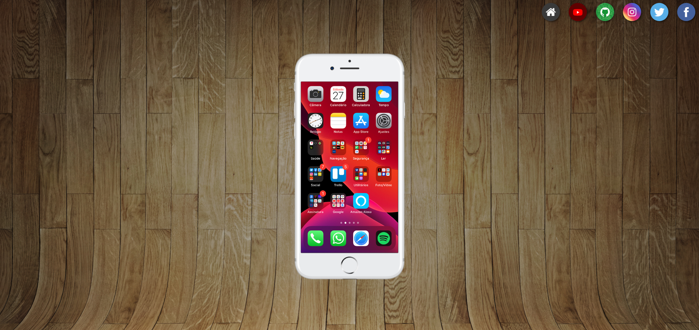

# 🌐 Projeto Sociais - Curso em Vídeo

Este é um projeto desenvolvido como parte do curso de **HTML5 e CSS3** do professor **Gustavo Guanabara**, disponível no portal [Curso em Vídeo](https://www.cursoemvideo.com).

O desafio consiste em criar uma **página inicial com links para redes sociais**, utilizando imagens redondas e navegação responsiva. O foco do exercício é praticar **links externos**, **imagens com transparência**, e o posicionamento de elementos com **HTML** e **CSS**.

## 🎯 Objetivos do Projeto

- Criar uma página simples com **ícones sociais clicáveis**
- Utilizar **imagens PNG com fundo transparente** e em formato circular
- Trabalhar com **posicionamento fixo/absoluto/relativo**
- Aplicar um layout limpo e funcional com base nos conceitos aprendidos no curso

## 🧰 Tecnologias Utilizadas

- HTML5
- CSS3

## 📁 Estrutura do Projeto

```
projeto-sociais/
├── index.html
├── style.css
├── imagens/
│   ├── perfil.png
│   ├── facebook.png
│   ├── instagram.png
│   ├── twitter.png
│   └── youtube.png
```

## 💻 Funcionalidades

- Imagem de perfil centralizada na tela
- Ícones das redes sociais fixados nos cantos da tela (ou nas laterais)
- Links externos abrindo em nova aba para cada rede social
- Layout adaptável a diferentes resoluções

## 📸 Screenshot




## 🔗 Link do projeto para visualização

[🔗 Ver Projeto Online](https://stapani7.github.io/projeto-redes-sociais)

## 📚 Créditos

Projeto desenvolvido como parte do curso **HTML5 e CSS3** do **Gustavo Guanabara** – [Curso em Vídeo](https://www.cursoemvideo.com).
